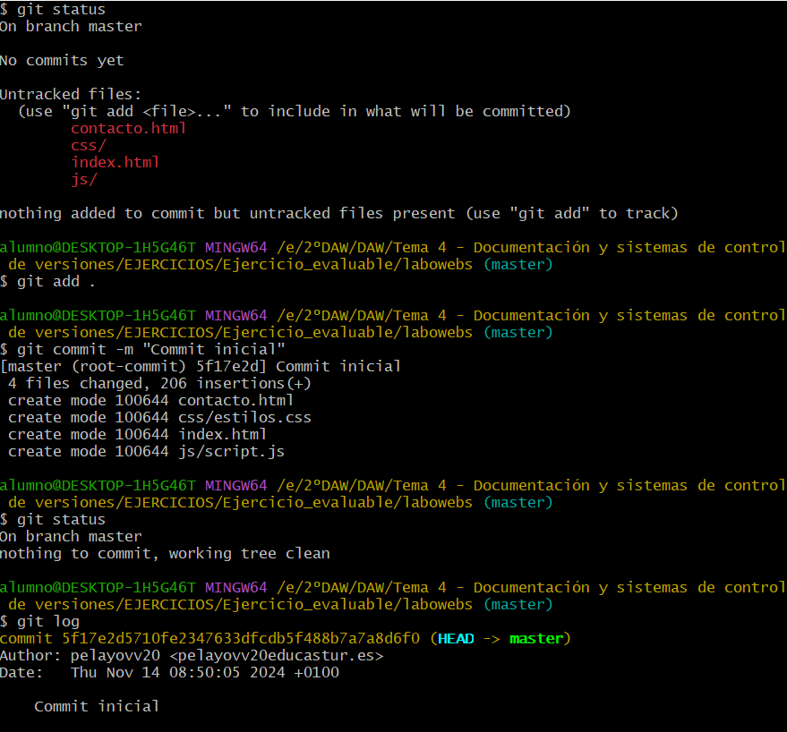
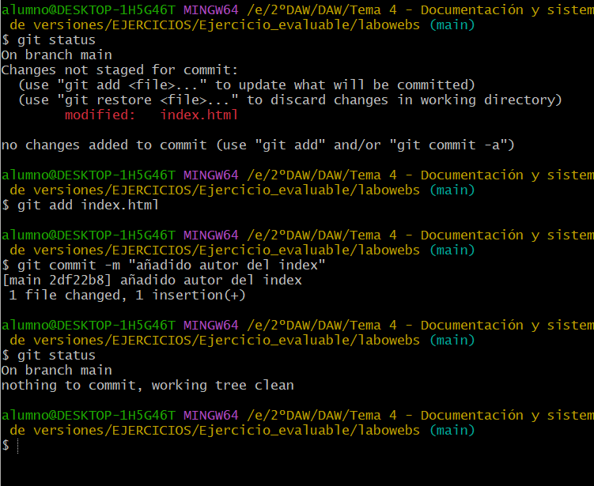
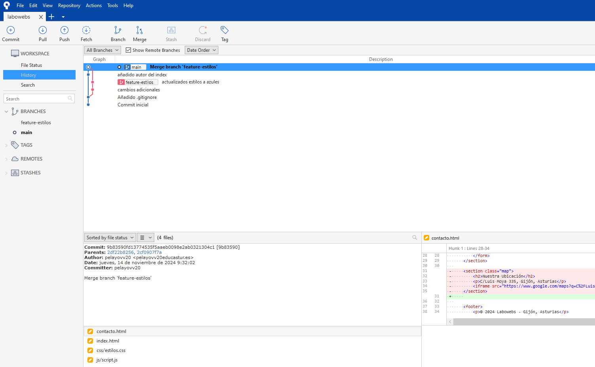
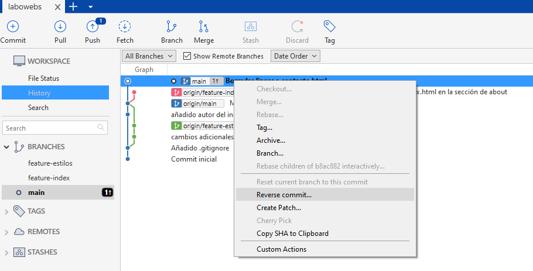
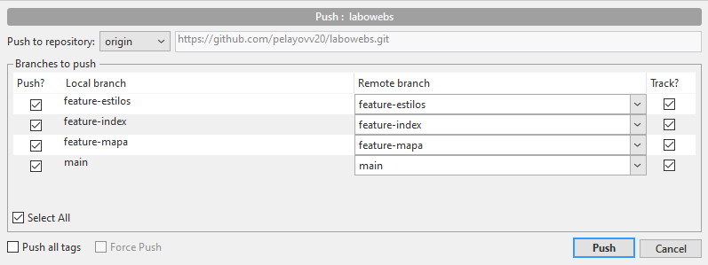

# Ejercicio de Git - proyecto labowebs

> Pelayo Vázquez Vidal 			
>
> Despliegue de Aplicaciones Web
>
> 2ºDAW


[TOC]

## Trabajo en local

> Trabajo individual en tu ordenador - Esta parte se resuelve con comandos. Tu solución debe incluir el enunciado de cada cuestión, un bloque de código con los  comandos GIT utilizados y captura/s de pantalla donde se vea la ejecución de los  comandos y su salida.

1.  Inicializa un nuevo repositorio Git en una carpeta llamada  `"labowebs"` y agrega los  archivos proporcionados en el aula virtual. Renombra la rama master a  `main`, si es  necesario. Realiza el primer commit. Muestra el log del repositorio.

   - Añado los contenidos proporcionados y inicializo el repositorio

     ```bash
     git init
     ```

     

   - Realizo el primer commit y miro el log del repositorio

     ```bash
     git add .
     git commit -m "Commit inicial"
     git log
     ```

     

   - Renombro la rama master a main y lo compruebo

     ```bash
     git branch -M main
     git branch
     ```

     

2. Incluye un fichero  `.gitignore` para que  los ficheros  `README.md`,  `LICENCE.txt` y  `passwords.txt` sean ignorados por el control de versiones. Realiza el commit y muestra  los logs del repositorio en una línea.

   - Creo el fichero `.gitignore` para los ficheros `README.md`, `LICENSE.txt` y `passwords.txt` y realizo un commit sobre ello

     ```bash
     git add .gitignore
     git commit -m "Añadido .gitignore"
     ```

     

   - Muestro los logs del repositorio en una sola línea

     ```bash
     git log --oneline
     ```

     

3. En el repositorio, crea los archivos   `README.md`,  `LICENCE.txt` y  `passwords.txt` con  algún contenido. Muestra el estado del repositorio. Muestra el listado de archivos  ignorados.

   - Creo los archivos y los modifico. Posteriormente, observo el estado del repositorio

     ```bash
     git status
     ```

     

   - Muestro el listado de archivos ignorados

     ```bash
     git status --ignored
     ```

     

4. Crea una rama  `feature-estilos`. Cámbiate a ella.

   - Creo una rama llamada `feature-estilos` y me cambio a ella

     ```bash
     git branch feature-estilos
     git checkout feature-estilos
     ```

     

   - Modifica el archivo  `estilos.css`: 

     ​	a)	propiedad color del  `body` y de `h2`:  `#0a0a0a` 

     

     ​	b)	propiedad `background-color` de  `header` y  `footer`:  `#8892C6`

     

   - Comprueba el estado del repositorio. Añade los cambios, realiza un commit con el  mensaje "actualizados estilos a azules"

     ```bash
     git status
     git add .
     git commit -m "actualizados estilos a azules"
     ```

     

5. Vuelve a la rama  `main`. En el archivo  `index.html` añade un comentario donde se indique  tu nombre como autor de la página. Comprueba el estado del repositorio. Añade los  cambios, realiza un commit con el mensaje ' añadido autor en index'. Muestra los logs del  repositorio en una línea, gráficamente y con 'decoración'

   - Vuelvo a la rama `main` y lo compruebo

     ```bash
     git checkout main
     git branch
     ```

     

   - En el archivo `index.html` añado un comentario con mi nombre

     

   - Compruebo el estado del repositorio. Añado los cambios, realizo un commit con el mensaje "añadido autor del index"

     ```bash
     git status
     git add index.html
     git commit -m "añadido autor del index"
     ```

     

   - Muestro los logs del  repositorio en una línea, gráficamente y con 'decoración'

     ```bash
     git log --all --oneline --decorate --graph
     ```

     

6. Fusiona la rama  `feature-estilos` en la rama  `main` . Muestra los logs del repositorio en  una línea, gráficamente y con 'decoración'

   - Fusiono la rama `feature-estilos` en la rama `main`

     ```bash
     git merge feature-estilos
     ```

     

   - Muestro los logs del  repositorio en una línea, gráficamente y con 'decoración'

     ```bash
     git log --all --oneline --decorate --graph
     ```

     

## Trabajo en remoto

> Esta parte se realizará con la herramienta gráfica  Sourcetree y con  GitHub. Para cada cuestión, incluye el enunciado y las capturas de pantalla donde se muestre la  solución. Si es necesario, incluye alguna explicación 

1. Continúa con el repositorio  `labowebs`.  Añade el repositorio a Sourcetree.

   

2. Crea un repositorio remoto y sube al remoto los ficheros de tu repositorio local. Debes  subir todas las ramas.

   ```bash
   git remote add origin https://github.com/pelayovv20/labowebs.git
   git push -u origin main
   git push -u origin feature-estilos
   ```

   

   

3. Crea una rama  `feature-index`.  Añade el siguiente código dentro de la `<section class="about">`. Añade los cambios y crea un commit. Sube los cambios al remoto.

   - Creo la rama `feature-index`

     

     

   - Añado el siguiente código en el archivo `index.html` dentro de la <section class="about">.

     

   - Añado los cambios y creo un commit

     

     

   - Subo los cambios al remoto

     

     

4. En el repositorio local, fusiona la rama  `feature-index` en la rama  `main`.

   

5. Edita el fichero  `contacto.html`. Borra unas líneas. Muestra los ficheros con cambios  pendientes y las diferencias. Añade los cambios y haz un commit.

   

   

   

6. Te das cuenta del error. Deshaz el commit anterior. Captura el estado actual del  repositorio.

   

   

   

   **El estado del repositorio está vacío porque al deshacer el último commit no hay ningún cambio pendiente**

7. Crea una rama  `feature-mapa` . Incluye este código en el archivo  `contacto.html`. Añade  los cambios. Realiza un commit. Sube los cambios al remoto. Muestra en el remoto los  cambios del archivo  `contacto.html` en la rama  `feature-mapa.` 

   >  Asegurarse de que  contacto.html queda con TODAS sus líneas

   - Creo la rama `feature-mapa`

   

   - Añado el código a `contacto.html`

     

   - Añado los cambios , hago un commit y lo subo al remoto

     

     

     

     

   

8. En GitHub,  en la rama  `main`, fusiona la rama  `feature-mapa`. Baja los cambios del remoto  a local. Deja los dos repositorios sincronizados.

   - Fusiono la rama `feature-mapa` en la rama `main` mediante una pull-request

   

   

   - Miro el historial de commits. El último commit es el del fusionado

   

   - Bajo los cambios al local mediante la opción `push` en SourceTree

   

   

## Conflictos

> Esta parte se realizará con la herramienta gráfica  Sourcetree y con  GitHub. Para cada cuestión, incluye el enunciado y las capturas de pantalla donde se muestre la  solución. Si es necesario, incluye alguna explicación  

1. Crea una rama  `hotfix-js`. Cámbiate a ella. Añade este código en el fichero `script.js`  Confirma el cambio y haz un commit.  (Fíjate en los números de línea...)

   - Creo la rama `hotfix-js` y me cambio a ella

   

   

   - Añado el código al fichero `script.js`

   

   - Confirmo el cambio y hago un commit

     

     

     

     

2. Vuelve a la rama  `main`. En el fichero  `script.js` en las mismas líneas que en la cuestión  anterior, añade el código siguiente. Confirma el cambio y haz un commit.

   - Añado el código en el archivo `script.js` desde la rama `main`

   

   - Confirmo cambios y hago un commit

   

   

   

3. Fusiona la rama  `hotfix-js` en  `main`. Debe producirse un conflicto. Resuélvelo. Cuando  termines la resolución del conflicto sube los cambios al remoto - Deja los repositorios  sincronizados

   - Fusiono las ramas 
   - Hago click derecho en el archivo, resolve Conflicts y resolve Using Theirs. (ya lo habíoa hecho por eso ahora no me deja)

   

   - Hago el commit y lo subo al remoto

   

   

## Subida de documentación

- Creo la carpeta `docs` e introduzco el archivo .md, la carpeta de imágenes y el pdf final

  

- Lo llevo al remoto

  ```bash
  git push -u origin main
  ```

  

  

> URL del repositorio: https://github.com/pelayovv20/labowebs.git
